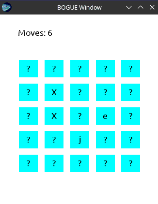

# Memory Game

<p align="center">
  
</p>

## How to run

Instructions below are for Arch Linux, but it should work on most distributions.

### 1. Install Opam (OCaml Package Manager)

Installing Opam will also install OCaml as a dependency so there is no need to install it separately.

```bash
sudo pacman -S opam #Or equivalent command for your distribution
```

During instalation you may be asked if you want to edit ~/.bash_profile. Select "yes". If you are not asked or you chose "no" then every
time before running "make" with a new terminal you will need to run the eval command listed below.

### 2. Install Dune (OCaml Build System)

To compile you will need "ocamlfind" command which is in "ocaml-findlib" package. Dune depends on that package.
If you do not want to install dune then installing "ocaml-findlib" should be enough, but I recommend installing dune as it will create less possible
problems.

```bash
sudo pacman -S dune
```

### 3. Install [Bogue](https://github.com/sanette/bogue)

```bash
sudo pacman -S pkg-config
opam install bogue
```

During installation you will be asked to install additional packages. Install them.
Afterwards restart terminal and run:

```bash
eval $(opam config env)
```

### 4. Compile

```bash
make
```

### 5. Run

```bash
./memory
```
